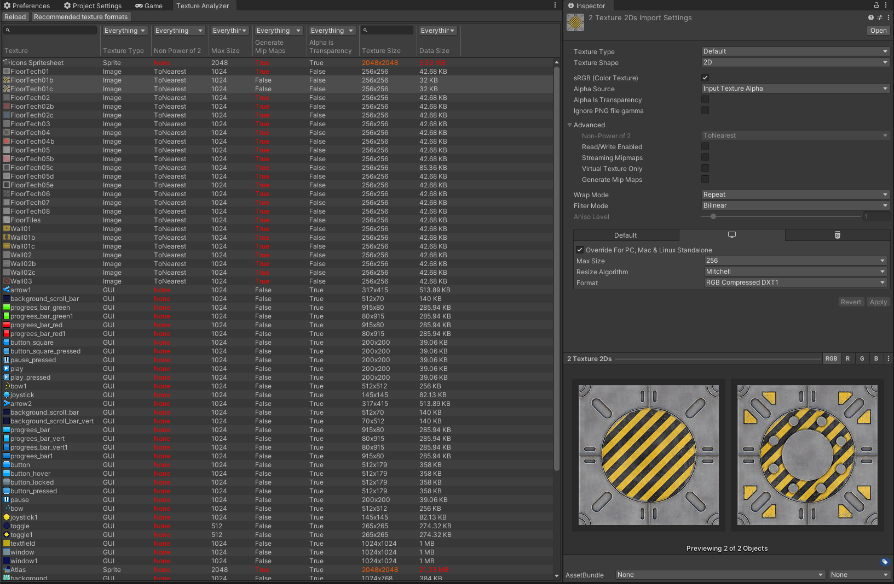

# Unity Texture analyzer.
Unity editor tool lists all project textures.
## Features:
- Displays import settings:

|Texture Type|NPOT|Max Size|Generate Mip Maps|Generate Mip Maps|Alpha Is Transparency|Texture Size|Data Size|
|-|-|-|-|-|-|-|-|

- Handy access to settings on select.
- Search and column sorting.



## Install UPM:
```git
https://github.com/Tokars/Unity-Texture-analyzer.git
```


## How to use
Editor menu open: `Window > Analysis > Texture Analyzer`